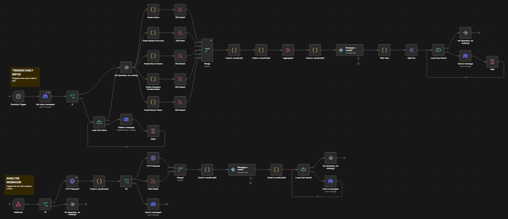

# TradingCorpBot

Bot Discord de recherche et d'analyse de tickers et
intégré avec n8n pour les traitements externes.

## But du projet :

Après la découverte de Make puis de n8n, j'ai voulu utiliser l'automatisation pour simplifier le traitement des informations de trading.
Dans un premier temps, j'ai créé un workflow afin de m'envoyer chaque jour, un résumé des informations les plus importantes, liées à mon portefeuille ou non.
Pour permettre à d'autres d'en profiter, j'ai créé ce bot discord afin que chacun ait un accès direct et rapide aux dernières informations.
Pour le choix du langage, j'ai hésité entre Go et Python. Les 2 étant des langages intéressants, Go m'a paru plus intéressant notamment dans la connexion avec Redis mais surtout car c'est un langage que j'apprécie et que je n'avais pas utilisé depuis quelque temps.

## Workflow n8n actuel :


## Installation

Prérequis

- Go 1.26 ou supérieur
- Docker (pour exécuter en local ou déployer en Swarm)
- (optionnel) Redis en local ou accessible

Étapes rapides

1. Cloner le dépôt :

```bash
git clone https://github.com/Zastial/TradingCorpBot.git
cd TradingCorpBot
```

2. Installer les dépendances Go :

```bash
go mod tidy
```

3. Copier le fichier `.env.example` avec les variables d'environnement nécessaires :

```bash
cp .env.example .env
```


4. (Optionnel) Démarrer Redis localement pour le développement :

```bash
docker run --rm -p 6379:6379 --name redis-local redis:7
```

---

## Exécution (Run)

Lancement local (développement)

```bash
go run .
```


Lancement en Docker (build + run)

```bash
docker build -t trading-corp-bot:local .
docker run --env-file .env -p 8080:8080 trading-corp-bot:local
```

Déploiement en Swarm (CI/production)

- Déployez le stack :

```bash
docker stack deploy -c docker-stack.yml trading_corp_bot
```

---

## Redis

Utilisation de Redis pour mettre en cache certains résultats et éviter des requêtes répétées vers les APIs externes.
Sert également à gérer la priorisation des requêtes d'analyse (ex: éviter de lancer plusieurs analyses pour le même ticker en même temps).

---

## Docker Swarm : replicas et secrets

Pourquoi Swarm ?

- Permet de déployer le bot sur plusieurs nœuds et d'assurer la haute disponibilité.

Replicas

- Les `replicas` indiquent combien d'instances du service doivent tourner.
- Exemple : `deploy.replicas: 3` dans le `docker-stack.yml` ou via `docker service scale`.
- Utilité : répartition de la charge et tolérance de panne

Secrets

- Les secrets Docker stockent des informations sensibles (tokens, clés API) sur le manager Swarm et sont injectés dans les containers via `/run/secrets/<NOM>`.
- Important : créez les secrets manuellement sur le manager (une seule fois)

Exemples de création (sur le manager Swarm) :

```bash
printf '%s' 'VALEUR_DISCORD_BOT_TOKEN' | docker secret create DISCORD_BOT_TOKEN -
printf '%s' 'VALEUR_N8N_API_KEY' | docker secret create N8N_API_KEY -
```
